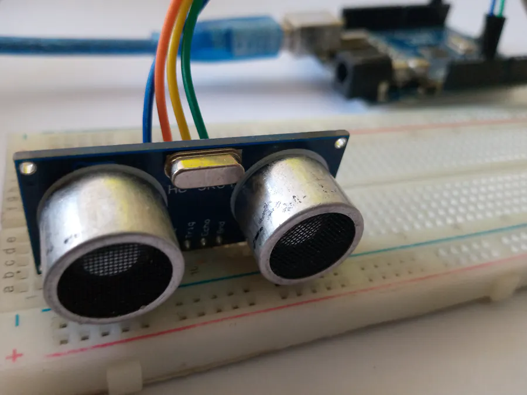
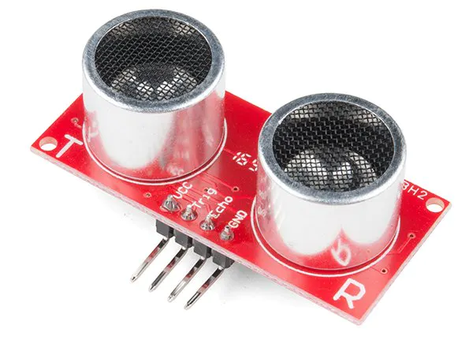
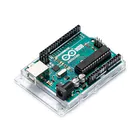

## Ultrasonic HC-SR04 Sensors

The HC-SR04 ultrasonic sensor uses SONAR to determine the distance of an object just like the bats do. It offers excellent non-contact range detection with high accuracy and stable readings in an easy-to-use package from 2 cm to 400 cm or 1” to 13 feet.  The operation is not affected by sunlight or black material, although acoustically, soft materials like cloth can be difficult to detect. It comes complete with ultrasonic transmitter and receiver module using the Arduino UNO IDE

## Technical Requirements

<table style="width:100%; border: 1px solid black;"

 <tr>
  <td><strong> Technical Specifications<strong></td>
  <td><strong> Requirements</strong></td>
 </tr>
 
 
 
 <td>
<ul>
 <li>Power Supply − +5V DC</li>
 <li>Quiescent Current − <2mA</li>
 <li>Working Current − 15mA</li>
 <li>Effectual Angle − <15°</li>
 <li>Ranging Distance − 2cm – 400 cm/1″ – 13ft</li>
 <li>Resolution − 0.3 cm</li>
 <li>Measuring Angle − 30 degree</li>
</ul>
 </td>

 

 <td>

#### >Arduino version 2.0.0-beta.9
#### >Breadboard
#### >ULTRASONIC Sensor HC-SR04
#### >Generic Jumper Wires
#### >Arduino UNO Device
 </td>
</table>   

## Connections

### The connections are very simple:
<table>
 <tr>
<ul>
 <td><li>VCC to 5V</li></td>
 <td><li>GND to GND</li></td>
 <td><li>Trig to pin 9</li></td>
 <td><li>Echo to pin 10</li></td>
</ul>
 </tr>
 </table>
<table>
 <tr>
  <td>

</td>
  <td>

</td>
  <td>

</td>
  
  
  
 </tr>
</table>

 ## Schematics
 ### HC-SRO4 Setup Diagram
 
  
Now that we have the time, we can use the equation speed = distance/time, but we will make it time x speed = distance because we have the speed. What speed do we have? The speed of sound, of course! The speed of sound is approximately 340 meters per second, but since the pulseIn() function returns the time in microseconds, we will need to have a speed in microseconds also, which is easy to get. A quick Google search for "speed of sound in centimeters per microsecond" will say that it is .0343 c/μS. You could do the math, but searching it is easier. Anyway, with that information, we can calculate the distance! Just multiply the duration by .0343 and then divide it by 2(Because the sound waves travel to the object AND back). We will store that in the distance variable.
 
 
 
 

https://user-images.githubusercontent.com/86418113/130119027-b4446f0f-61a4-4c52-8c8a-a62db999f1e8.mp4

 
 
 
 

